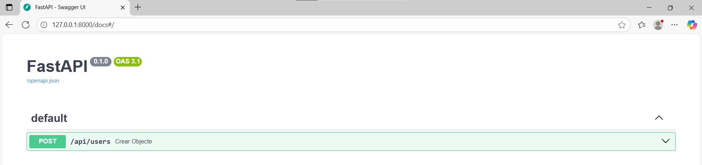
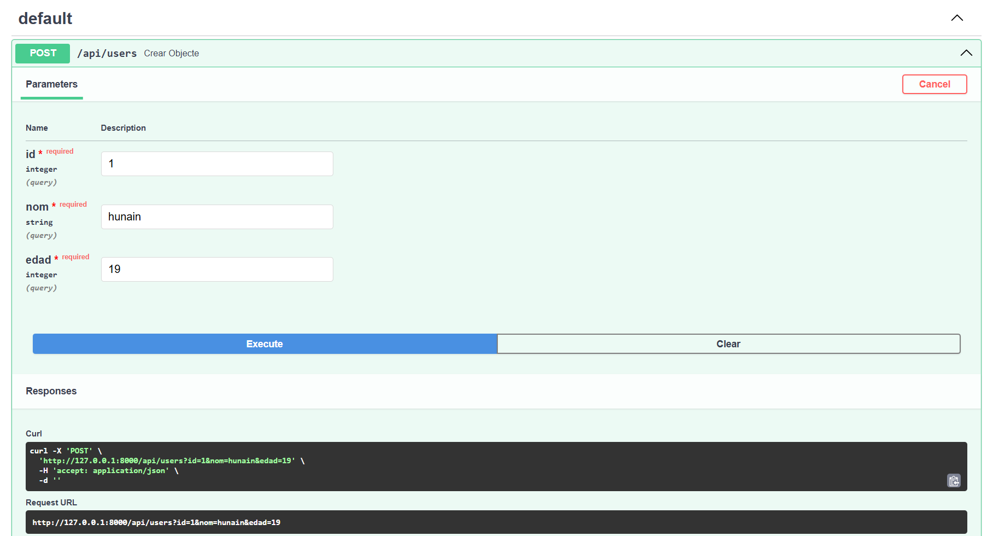
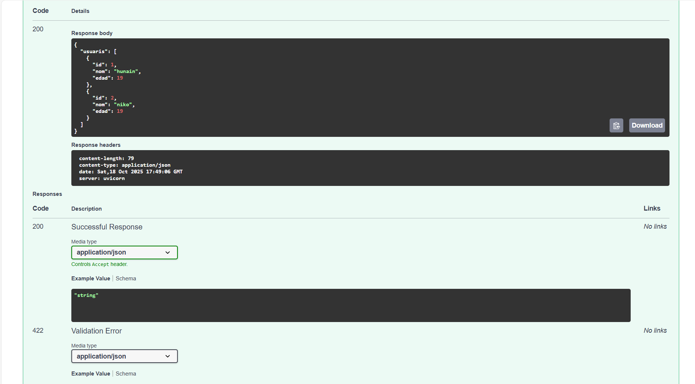
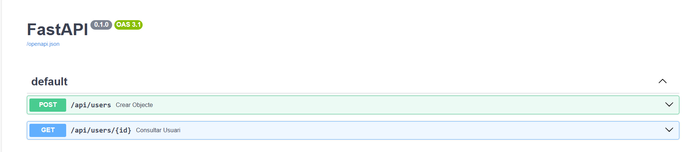
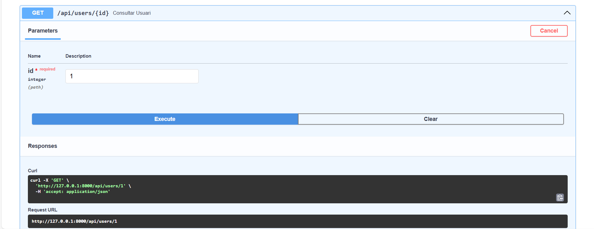
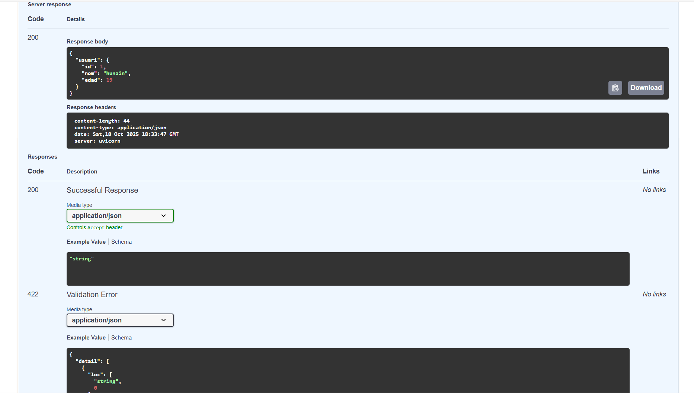
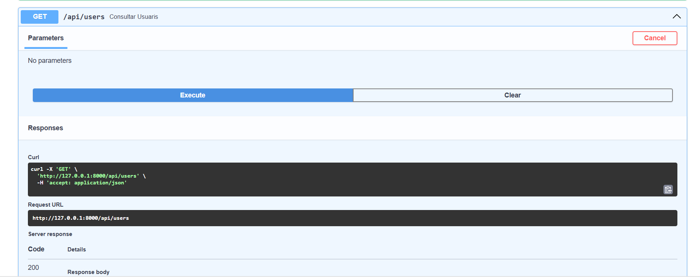
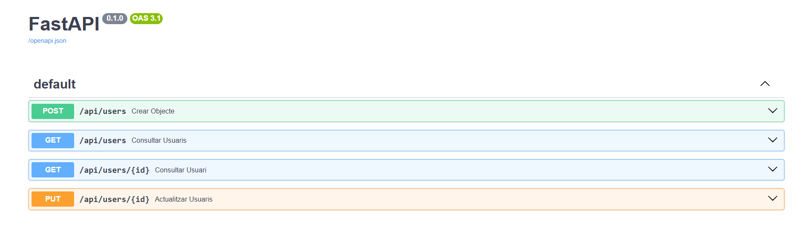
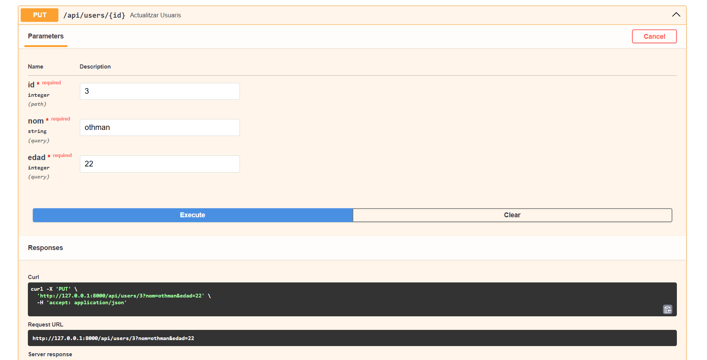
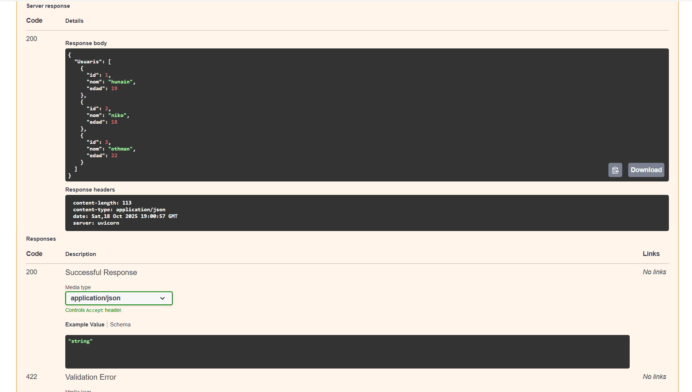

# FastAPI_mukhtar

## ACTIVITAT-1 POST

Crear un nou objecte i afegir-lo a la list de nom users.

## ACTIVITAT-2 GET

Buscar l’usuari o objecte de la list amb el que es passi per paràmetre {id}.

## ACTIVITAT-3 GET

Haurà de buscar tots els usuaris o objectes de la llista.

## ACTIVITAT-4 PUT

Actualitzar un objecte (sigui una lletra o canvi sencer) de la list.

